|                                **Gender**                                 |                                **Bangs**                                |                               **Body Side**                                |                                 **Pose (Yaw)**                                 |
|                                    :-:                                    |                                   :-:                                   |                                    :-:                                     |                                      :-:                                       |
|  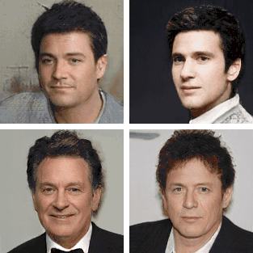   |  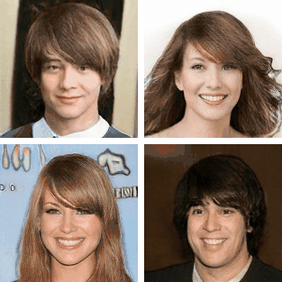  | 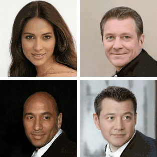  |      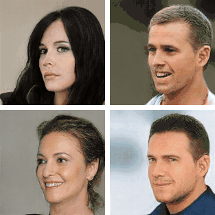      |
|                               **Lighting**                                |                                **Smile**                                |                               **Face Shape**                               |                               **Lipstick Color**                               |
| 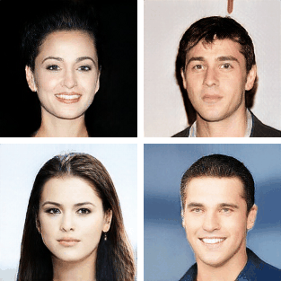  | 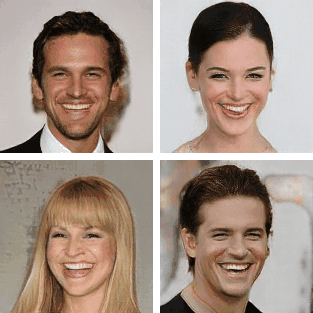 | 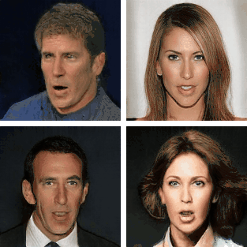 | 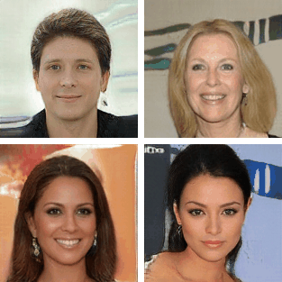 |

|                            **Painting Style**                             |                             **Pose (Yaw)**                              |                              **Pose (Pitch)**                              |                               **Zoom & Rotate**                                |
|                                    :-:                                    |                                   :-:                                   |                                    :-:                                     |                                      :-:                                       |
| 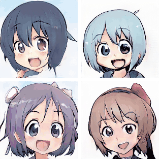  |     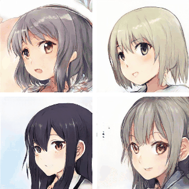      |       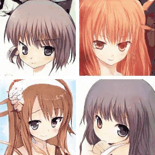       |     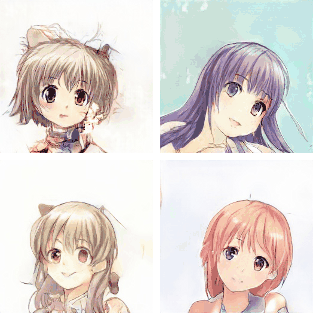      |
|                           **Flush & Eye Color**                           |                             **Mouth Shape**                             |                               **Hair Color**                               |                             **Hue (Orange-Blue)**                              |
| 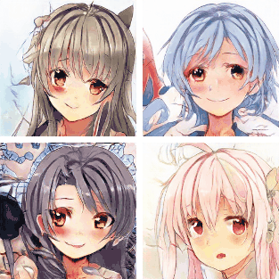 |  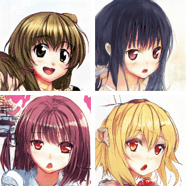  |    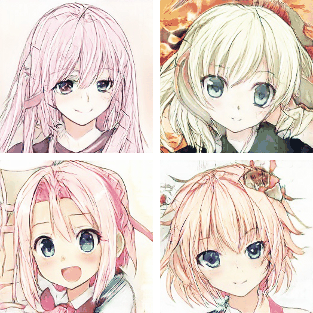    |         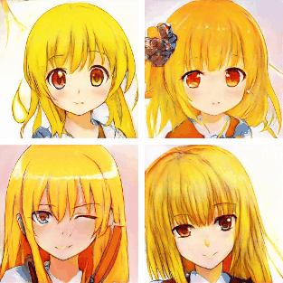          |

#### [More Unsupervisedly Learned Dimensions](./results.md)

<hr style="height:1px" />

# <p align="center"> [EigenGAN](https://arxiv.org/pdf/2104.12476.pdf) </p>

**TensorFlow** implementation of [**EigenGAN**: Layer-Wise Eigen-Learning for GANs](https://arxiv.org/pdf/2104.12476.pdf)
&nbsp;
&nbsp;
&nbsp;
<p align="center"> 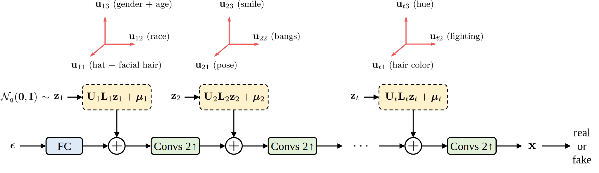 </p>

## Usage

- Environment

    - Python 3.6

    - TensorFlow 1.15

    - OpenCV, scikit-image, tqdm, oyaml

    - *we recommend [Anaconda](https://www.anaconda.com/distribution/#download-section) or [Miniconda](https://docs.conda.io/en/latest/miniconda.html#linux-installers), then you can create the environment with commands below*

        ```console
        conda create -n EigenGAN python=3.6

        source activate EigenGAN

        conda install opencv scikit-image tqdm tensorflow-gpu=1.15

        conda install -c conda-forge oyaml
        ```

    - *NOTICE: if you create a new conda environment, remember to activate it before any other command*

        ```console
        source activate EigenGAN
        ```

- Data Preparation

    - [CelebA](http://openaccess.thecvf.com/content_iccv_2015/papers/Liu_Deep_Learning_Face_ICCV_2015_paper.pdf)-unaligned (10.2GB, higher quality than the aligned data)

        - download the dataset

            - img_celeba.7z (move to **./data/img_celeba/img_celeba.7z**): [Google Drive](https://drive.google.com/drive/folders/0B7EVK8r0v71pTUZsaXdaSnZBZzg) or [Baidu Netdisk](https://pan.baidu.com/s/1CRxxhoQ97A5qbsKO7iaAJg) (password rp0s)

            - annotations.zip (move to **./data/img_celeba/annotations.zip**): [Google Drive](https://drive.google.com/file/d/1xd-d1WRnbt3yJnwh5ORGZI3g-YS-fKM9/view?usp=sharing)

        - unzip and process the data

            ```console
            7z x ./data/img_celeba/img_celeba.7z/img_celeba.7z.001 -o./data/img_celeba/

            unzip ./data/img_celeba/annotations.zip -d ./data/img_celeba/

            python ./scripts/align.py
            ```

    - [Anime](https://www.gwern.net/Crops)

        - download the dataset

            ```console
            mkdir -p ./data/anime

            rsync --verbose --recursive rsync://78.46.86.149:873/biggan/portraits/ ./data/anime/original_imgs
            ```

        - process the data

            ```console
            python ./scripts/remove_black_edge.py
            ```

- Run (support multi-GPU)

    - training on CelebA

        ```console
        CUDA_VISIBLE_DEVICES=0,1 \
        python train.py \
        --img_dir ./data/img_celeba/aligned/align_size(572,572)_move(0.250,0.000)_face_factor(0.450)_jpg/data \
        --experiment_name CelebA
        ```

    - training on Anime

        ```console
        CUDA_VISIBLE_DEVICES=0,1 \
        python train.py \
        --img_dir ./data/anime/remove_black_edge_imgs \
        --experiment_name Anime
        ```

    - testing

        ```console
        CUDA_VISIBLE_DEVICES=0 \
        python test_traversal_all_dims.py \
        --experiment_name CelebA
        ```


    - loss visualization

        ```console
        CUDA_VISIBLE_DEVICES='' \
        tensorboard \
        --logdir ./output/CelebA/summaries \
        --port 6006
        ```

- Using Trained Weights

    - trained weights (move to **./output/\*.zip**)

        - [CelebA.zip](https://drive.google.com/file/d/1_WAV9uFWSsXUXkBoOi5NnPSLIeLvz-w4/view?usp=sharing)

        - [Anime.zip](https://drive.google.com/file/d/1gc8ssDwVvK1vUHsf_t2kWF42dYsp65bG/view?usp=sharing)


    - unzip the file (CelebA.zip for example)

        ```console
        unzip ./output/CelebA.zip -d ./output/
        ```

    - testing (see above)

## Citation

If you find [EigenGAN](https://arxiv.org/pdf/2104.12476.pdf) useful in your research works, please consider citing:

    @article{he2021eigengan,
      title={EigenGAN: Layer-Wise Eigen-Learning for GANs},
      author={Zhenliang He and Meina Kan and Shiguang Shan},
      journal={arXiv:2104.12476},
      year={2021}
    }